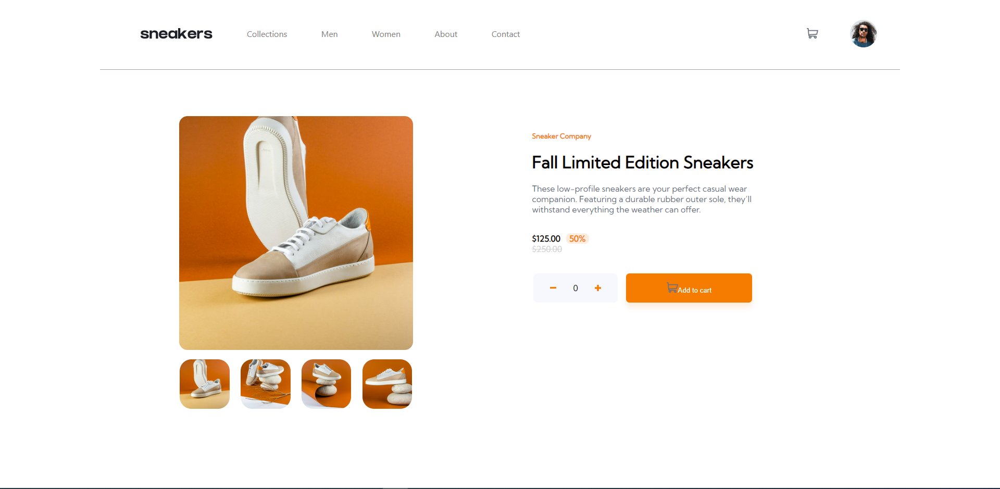

# Frontend Mentor - E-commerce product page solution

This is a solution to the [E-commerce product page challenge on Frontend Mentor](https://www.frontendmentor.io/challenges/ecommerce-product-page-UPsZ9MJp6). Frontend Mentor challenges help you improve your coding skills by building realistic projects.

## Table of contents

  - [The challenge](#the-challenge)
  - [Screenshot](#screenshot)
  - [Links](#links)
- [My process](#my-process)
  - [Built with](#built-with)
  - [What I learned](#what-i-learned)
  - [Continued development](#continued-development)
  - [Useful resources](#useful-resources)
- [Author](#author)


### The challenge

Users should be able to:

- View the optimal layout for the site depending on their device's screen size
- See hover states for all interactive elements on the page
- Open a lightbox gallery by clicking on the large product image
- Switch the large product image by clicking on the small thumbnail images
- Add items to the cart
- View the cart and remove items from it

### Screenshot



### Links

- Live Site URL: [GH-Pages](https://phellwege.github.io/ecommerce-product-page-component/)

## My process

### Built with

- Semantic HTML5 markup
- CSS custom properties
- Flexbox
- Mobile-first workflow
- [React](https://reactjs.org/) - JS library

### What I learned

I improved my use of props and state throughout the project, and really feel like I got a grasp of using ternaries appropriately. 

To see how you can add code snippets, see below:

Some Basic JS Code I was proud of was the use of ternary statements to determine what to show in the cart, or what not to show.
```js
<div className="cartBoxBox">
                {props.numInCart == 0 ? '' : } 
                <div className="cartBoxText">
                    {props.numInCart == 0 ? 'Your Shopping Cart Is Empty' : 'Fall Limited Edition Sneakers'} 
                    <br/>
                    {props.numInCart == 0 ? '' : props.numInCart} 
                    {props.numInCart == 0 ? '' : ' X '} 
                    {props.numInCart == 0 ? '' : ' 125 '} 
                    <span id='boldMe'>
                        {props.numInCart == 0 ? '' : '$'}
                        {props.numInCart == 0 ? '' : props.numInCart * 125.00}
                    </span>
                </div>
                {props.numInCart == 0 ? '' : 
                    
                } 
                
            </div>
            {props.numInCart == 0 ? '' : 
                <button className="checkout" onClick={cartBoxShow}>
                    Checkout
                </button>
            }
```

### Continued development

A few area I would still like some more work on are understanding asynchronous operations within ReactJS. There were a few tasks that took me longer than they should have because of my limited knowledge of this.

### Useful resources

- [Example resource 1](https://www.example.com) - This helped me for XYZ reason. I really liked this pattern and will use it going forward.
- [Example resource 2](https://www.example.com) - This is an amazing article which helped me finally understand XYZ. I'd recommend it to anyone still learning this concept.

**Note: Delete this note and replace the list above with resources that helped you during the challenge. These could come in handy for anyone viewing your solution or for yourself when you look back on this project in the future.**

## Author

- Website - [Peter Hellwege](https://peters-portfolio.net)
- Frontend Mentor - [@yourusername](https://www.frontendmentor.io/profile/yourusername)
